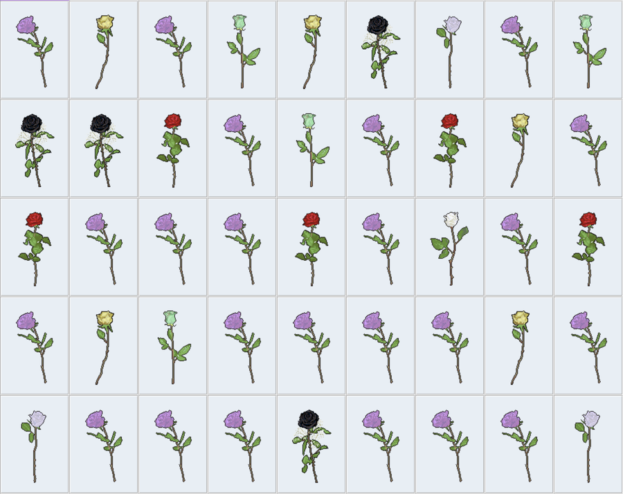

# Code Words Spells: Variables & Functions in Javascript


## Javascript
Javascript is a language for making dynamic websites. Javascript lives and breathes in _the Browser_.

## Variables

- variables are named containers that hold information. When we name something we can refer to it later. Naming is powerful.
- words in language are like variables. They are named containers that hold meaning. To name something is declare the existance of the thing we are naming. names for words and variables don't emerge from the ether, they are collectively constructed and reaffirmed by people. what are the social histories of the words you speak?


Example Variables in Javascript:
```
var dog = "woof";
var myFavNumber = 7;
```

- Notice the quotations for a variable that contains a line of text (variable type is called a string). Notice that for a variable type of number, there are no quations. Why do you think that is?
- Notice the capitalization/naming conventions. Javascript culture tends to implement what is known as camelCase.

**Variable types**

- Variables in any language have different data types. Two common types are called strings and numbers.
- A string is a line of text like "cat", with quotation marks around it. A variable data type of number is represented by numerical character(s) that you can perform math on.
- Notice that x = 2 is a data type of number but x = "2" is actually a data type of string. The former could be added and subtracted, the latter is simply the character "2"


Javascript:
```
var dog = "woof";
var myFavNumber = 7;

console.log(typeof dog);

console.log(typeof myFavNumber);

```

## Functions
- A function is a block of reusable code (like a shortcut!) that is used to perform an action. Functions provide modularity for your project and the ability to easily reuse and repurpose code. Technically, any piece of code (from your website to the code that runs Facebook) can be written without using functions but you wouldnt want to do this because your code would then be so long!

- Lanhguages like Javascript give you many built-in functions like console.log(), etc. but you can also create your own functions. These functions are called user-defined functions.


Function in Javascript:
```
var dog = "woof";

function printMe(my_var){
  console.log(my_var);
}

printMe(dog);
```

**If Statements**


Javascript:

```
var dog = "woof";
var myFavNumber = 7;

if (typeof dog == typeof myFavNumber) {
  console.log("they are the SAME data type!");
} else {
  console.log("they are DIFFERENT data types!");
};
```

<blockquote class="twitter-tweet"><p lang="en" dir="ltr">words have power to make things so.<br>code has power to make things so.<br>spells have power to make things so.<br><br>when we write code for ourselves and our friends, code that this is written with care, with intention and with intimacy, this literally the stuff of magic</p>&mdash; ⟴ ↭ ⥉ ⬼ ↯ ↬ (@melanieh0ff) <a href="https://twitter.com/melanieh0ff/status/1215728556346691584?ref_src=twsrc%5Etfw">January 10, 2020</a></blockquote>



